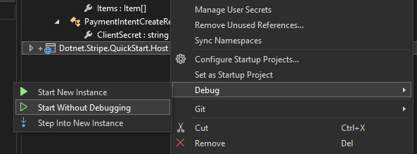

# Stripe QuickStart for .NET

## Prerequisites

- .NET 8
- Visual Studio or Visual Studio Code
- .NET Android and .NET iOS workloads

## Server

### Steps

1/ Create your `Shared.dev.cs` by copying `Shared.dev.cs.sample`

1.a/ File location

```
|--src
    |-- QuickStart.Dotnet.StripeHost
        |-- Shared.cs
        |-- Shared.dev.cs        <------      YOUR_FILE_HERE
```

1.b/ File content

```cs
namespace QuickStart.Dotnet.Stripe;

// TODO Replace placeholders with yours
partial class ClientHelper
{
    public const string API_KEY = "YOUR_API_KEY";
    public const string DEFAULT_PUBLISHABLE_KEY = "YOUR_DEFAULT_PUBLISHABLE_KEY";
    public const string BACKEND_URL = "YOUR_BACKEND_URL"; // Replace with the generated link at step #3
}
```

2/ Run up the web server without debugging



3/ Expose your local webserver with [ngrok](https://ngrok.com)

```
ngrok http http://localhost:4242
```

## Android

 This quick start is based on [the official quick start guide](https://docs.stripe.com/payments/quickstart?client=java) from Stripe. It will guide you how to use Stripe Android SDK binding libraries created by [tuyen-vuduc](https://github.com/tuyen-vuduc). The source of the binding libraries can be found [here](https://github.com/tuyen-vuduc/dotnet-binding-utils).

> To understand all functionalities of Stripe Android SDK, please check out [the official document](https://docs.stripe.com/libraries/android) and [the official repository](https://github.com/stripe/stripe-android).

### Steps to run the sample app

1/ Select the right project and a device/an emulator
2/ Run up and try out the sample app

### Steps to use in your app

1/ Add required NuGet packages

> We need `Xamarin.KotlinX.Serialization.Core` added directly because it wasn't detected as an indirect dependency for Stripe Android SDK via [my dotnet-binding-util](https://github.com/tuyen-vuduc/dotnet-binding-utils) when creating the binding library.

```
    <PackageReference Include="Com.Stripe.StripeAndroid" Version="20.46.0" />
    <PackageReference Include="Xamarin.KotlinX.Serialization.Core" Version="1.6.3.3" />
```

## iOS

This quick start is based on [the official quick start guide](https://docs.stripe.com/payments/quickstart?client=ios) from Stripe. It will guide you how to use Stripe iOS SDK binding libraries created by [tuyen-vuduc](https://github.com/tuyen-vuduc). The source of the binding libraries can be found [here](https://github.com/tuyen-vuduc/dotnet-binding-utils).

> To understand all functionalities of Stripe iOS SDK, please check out [the official document](https://docs.stripe.com/libraries/ios) and [the official repository](https://github.com/stripe/stripe-ios).

### Steps to run the sample app

1/ Select the right project and a device/simulator

2/ Run up and try out the sample app

### Steps to use in your app

1/ Add required NuGet packages

```
    <PackageReference Include="TVStripePaymentSheet.iOS" Version="23.27.5" />
```

## MAUI

### Run the quickstart

NOTE > [Check its repo](https://github.com/tuyen-vuduc/dotnet-maui-stripe) for further info and customization.

0/ Open `dotnet-stripe-qs.maui.sln`
1/ Select `StripeMaui` project as the start up and prepare a device/an emulator
2/ Run up and try out the sample app for each platform

### Steps to use in your app

1/ Add required NuGet packages

```
    <PackageReference Include="Stripe.MAUI" Version="1.204600.232705" />
```

## MAINTAINER

This project is maintained by [tuyen-vuduc](https://github.com/tuyen-vuduc) in his spare time.<br>

If you find this project is useful, please become a sponsor of the project and/or buy him a coffee.

[](https://www.buymeacoffee.com/tuyen.vuduc)

OR

[](https://github.com/sponsors/tuyen-vuduc)

## LICENSE

The 3rd libraries will follow their associated licenses. This project itself is license under MIT license.

Copyright 2024 tuyen-vuduc

Permission is hereby granted, free of charge, to any person obtaining a copy of this software and associated documentation files (the "Software"), to deal in the Software without restriction, including without limitation the rights to use, copy, modify, merge, publish, distribute, sublicense, and/or sell copies of the Software, and to permit persons to whom the Software is furnished to do so, subject to the following conditions:

The above copyright notice and this permission notice shall be included in all copies or substantial portions of the Software.

THE SOFTWARE IS PROVIDED "AS IS", WITHOUT WARRANTY OF ANY KIND, EXPRESS OR IMPLIED, INCLUDING BUT NOT LIMITED TO THE WARRANTIES OF MERCHANTABILITY, FITNESS FOR A PARTICULAR PURPOSE AND NONINFRINGEMENT. IN NO EVENT SHALL THE AUTHORS OR COPYRIGHT HOLDERS BE LIABLE FOR ANY CLAIM, DAMAGES OR OTHER LIABILITY, WHETHER IN AN ACTION OF CONTRACT, TORT OR OTHERWISE, ARISING FROM, OUT OF OR IN CONNECTION WITH THE SOFTWARE OR THE USE OR OTHER DEALINGS IN THE SOFTWARE.